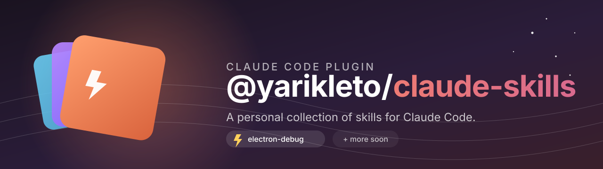

<p align="center">
  
</p>

<h1 align="center">@yarikleto/claude-skills</h1>

<p align="center">
  <em>A personal collection of skills for <a href="https://claude.com/claude-code">Claude Code</a>.</em>
</p>

<p align="center">
  <a href="https://github.com/yarikleto/claude-skills/commits/main"></a>
  <a href="./LICENSE"></a>
  
</p>

---

## Install

Pick the route that fits.

### CLI — pick individual skills

The repo ships a small interactive CLI that copies any skill into either your user-level or the current project's `.claude/skills/` directory.

```bash
npx @yarikleto/claude-skills            # interactive menu
npx @yarikleto/claude-skills list       # show all skills + installed state
npx @yarikleto/claude-skills add        # interactive picker
npx @yarikleto/claude-skills add electron-debug --scope user
npx @yarikleto/claude-skills remove electron-debug --scope project
```

Scopes:

- `user` → `~/.claude/skills/<name>/` — available in every project
- `project` → `./.claude/skills/<name>/` — scoped to the current working dir

Pass `--scope` to skip the prompt. Pass `-y/--yes` to skip confirmations. Run `--help` for the full usage.

### Plugin — install everything

This repo is also a Claude Code plugin and its own marketplace. In Claude Code:

```text
/plugin marketplace add yarikleto/claude-skills
/plugin install @yarikleto/claude-skills@yarikleto
```

The install syntax is `<plugin-name>@<marketplace-name>`, so the scoped plugin name `@yarikleto/claude-skills` is paired with the marketplace name `yarikleto`.

For local development:

```bash
claude --plugin-dir /path/to/claude-skills
```

## Skills

| Skill | What it does |
| --- | --- |
| [`electron-debug`](./skills/electron-debug/SKILL.md) | Launches an Electron app headlessly via Playwright, captures main + renderer logs and page errors, optionally screenshots, then exits — used to verify Electron apps boot cleanly after code changes. |

## Adding a new skill

1. Create `skills/<skill-name>/SKILL.md` with frontmatter (`name`, `description`).
2. Add any helper files under `skills/<skill-name>/` (e.g. `scripts/`, `templates/`). Reference them from `SKILL.md` using `${CLAUDE_PLUGIN_ROOT}/skills/<skill-name>/...` so paths resolve regardless of which project the skill runs from.
3. Bump the version in both `.claude-plugin/plugin.json` and `package.json`.
4. Commit and push.

## Layout

```text
.claude-plugin/
  plugin.json        plugin manifest
  marketplace.json   marketplace manifest (so this repo installs directly)
bin/
  skills.js          the claude-skills CLI
skills/
  <skill-name>/
    SKILL.md
    scripts/ …       optional helpers
.github/
  assets/            README images
```
